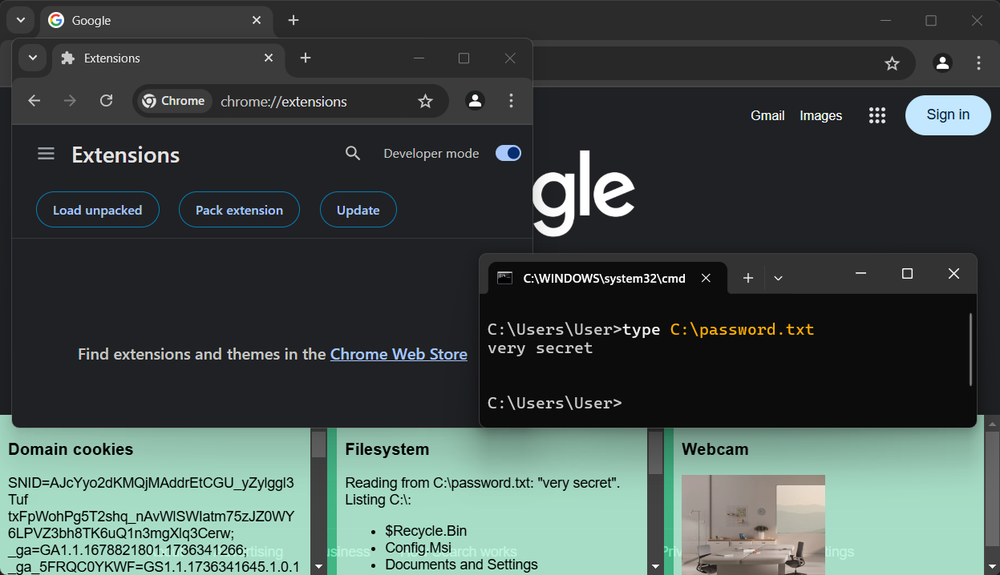

# Chromium Profile Tampering Proof of Concept

This project is a proof of concept (POC) that demonstrates how Chromium profile
files can be modified to enable stealthy extension installation and tampering,
allowing arbitrary code to be injected with extensive capabilities.

For more information, refer to the [blog
post](https://www.island.io/blog/chromiums-security-blind-spot-the-case-of-the-hidden-extension).

**Disclaimer:** This POC is for educational and research purposes only. Misuse
of this information for malicious activity is strictly prohibited.



## Overview

This POC modifies a Chromium profile to:

- Install a new extension.
- Hide the installed extension from the browser's UI.
- Add custom code to the extension without triggering reinstallation or causing
  the extension to be marked as "corrupted".
- Adjust extension permissions, such as allowing webcam access without prompting
  the user.

## Demonstrated Capabilities

This POC highlights potential abuses, including:

- **File System Access:** Gaining read-only access to all files on the system.
- **Webcam Access:** Accessing the webcam without user permission and without
  visual recording indicators.

## Usage

The provided Python script modifies a Chromium profile to demonstrate these
capabilities.

1. **Installation:** No additional dependencies are required beyond Python 3.
2. **Execution:** Run the Python script against a target Chromium profile
   directory:
   ```
   python profile_tampering_poc.py [profile_path] [registry_path] [is_google_chrome]
   ```
   If no arguments are provided, the script will prompt for input.
3. **Verification:** Start the browser and observe:
   - The extension is active but hidden from `chrome://extensions/` and the
     extensions toolbar.
   - The extension can access all websites and their data.
   - The extension can access the file system and read files without user
     interaction.
   - The extension has access to the webcam without permission prompts or
     indicators.

## Supported Versions

- **Chromium versions:** M135 and below
- **Operating System:** Windows

**Note:** The underlying technique works on all platforms. However, this POC
implementation targets Windows only for simplicity.

## Disclaimer

The limitations exploited in Chromium's implementation (as seen in this POC) are
not considered vulnerabilities according to Chromium's threat model. The sole
intention is to demonstrate the potential risks of local access attacks.

Due to updates made to the Chromium project, this POC may only work with
Chromium versions older than 136.
